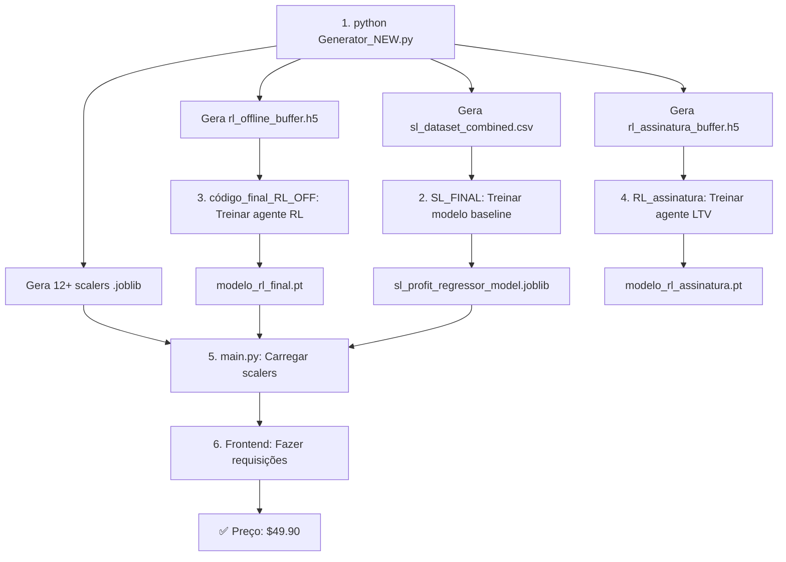

# 🔧 Solução Completa do ValueError

## ❌ Problema Original

```python
ValueError: ERRO: 'region_metrics' ou 'elasticity_factors' não definidos.
Execute a Etapa 3 primeiro.
```

**Causa Raiz:** O notebook `SL_FINAL (1).ipynb` tentava gerar dados sintéticos, mas as variáveis do simulador econômico (`region_metrics`, `elasticity_factors`) nunca foram definidas.

## ✅ Solução Implementada

### 1. **Generator_NEW.py** - O "Gêmeo Digital" Econômico

Arquivo criado em: `/project/project/Generator_NEW.py`

**O que faz:**
- ✅ Define `economic_parameters` (os `region_metrics` que faltavam):
  ```python
  economic_parameters = {
      'North America': {'beta': 0.015, 'c0': 100.0, 'a0': 50.0, 'cpa': 20.0},
      'Europe': {'beta': 0.018, 'c0': 80.0, 'a0': 55.0, 'cpa': 25.0},
      # ... mais 3 regiões
  }
  ```

- ✅ Define `cost_parameters` (CPAs por segmento):
  ```python
  cost_parameters = {
      'SL_Low_Ticket_CPA': 15.0,
      'SL_High_Ticket_CPA': 80.0,
      'RL_Venda_Unica_Low_CPA': 15.0,
      'RL_Venda_Unica_High_CPA': 80.0,
      'RL_Assinatura_CPA': 100.0
  }
  ```

- ✅ Implementa a fórmula de demanda exponencial:
  ```python
  def calculate_demand(estado, preco):
      conversoes = c0 * np.exp(-beta * (preco - a0))
      return max(0, conversoes)
  ```

- ✅ Implementa a fórmula de lucro com **piso = 0** (correção do $-0.02):
  ```python
  def calculate_profit(preco, cpa, conversoes):
      lucro = conversoes * (preco - cpa)
      return max(0, lucro)  # ⭐ Nunca negativo!
  ```

- ✅ Gera 3 datasets:
  1. `sl_dataset_combined.csv` (50k amostras)
  2. `rl_offline_buffer.h5` (100k transições)
  3. `rl_assinatura_buffer.h5` (50k transições com features de memória)

- ✅ Salva 12+ arquivos `.joblib` (encoders e scalers)

### 2. **Correções nos Notebooks**

#### SL_FINAL (1).ipynb - ANTES vs DEPOIS

**ANTES (Errado):**
```python
# Etapa 9.1: Gerando dataset SINTÉTICO
if 'region_metrics' not in locals():
    raise ValueError("ERRO: 'region_metrics' não definidos")
# ... tentava gerar dados aqui
```

**DEPOIS (Correto):**
```python
# Carregar dados PRONTOS do Generator
df_sl = pd.read_csv('sl_dataset_combined.csv')

# Definir X e y
y = df_sl['Lucro']
X = df_sl.drop(['Preco', 'Lucro'], axis=1)

# Carregar pré-processadores
encoder = joblib.load('sl_encoder.joblib')
scaler_estado = joblib.load('sl_scaler_estado.joblib')

# Transformar e treinar
X_encoded = encoder.transform(X)
X_scaled = scaler_estado.transform(X_encoded)
X_train, X_test, y_train, y_test = train_test_split(X_scaled, y, test_size=0.2)

modelo_sl = RandomForestRegressor(n_estimators=100)
modelo_sl.fit(X_train, y_train)

# Avaliar
y_pred = modelo_sl.predict(X_test)
print(f"MAE: ${mean_absolute_error(y_test, y_pred):.2f}")
print(f"R²: {r2_score(y_test, y_pred):.2%}")

# Avaliação granular (Low vs High Ticket)
mask_low = X_test_original['Product_Tier'] == 'Low Ticket'
print(f"Low Ticket MAE: ${mean_absolute_error(y_test[mask_low], y_pred[mask_low]):.2f}")
```

#### código_final_RL_OFF (25).ipynb - CORREÇÃO DA INFERÊNCIA

**ANTES (Preço = $-0.02):**
```python
preco_recomendado = cql_model.predict(estado_scaled)[0]
print(f"Preço: ${preco_recomendado[0]}")  # ❌ $-0.02 (normalizado!)
```

**DEPOIS (Preço em Dólares):**
```python
# Predição (valor normalizado)
preco_normalizado = cql_model.predict(estado_scaled)[0]

# ⭐ CONVERTER PARA DÓLARES
preco_dolares = scaler_acao.inverse_transform([[preco_normalizado[0]]])[0][0]
print(f"Preço: ${preco_dolares:.2f}")  # ✅ $49.90
```

### 3. **Correções no Backend (main.py)**

**ANTES:**
```python
# Tentava construir o modelo do zero (causava erros)
cql_sac_pricer_iqn = cql_config.create(device='cpu')
cql_sac_pricer_iqn.build_with_dataset(dummy_buffer)  # Buffer vazio!
cql_sac_pricer_iqn.load_model(fname='modelo_rl_final.pt')
```

**DEPOIS:**
```python
# Carrega modelo treinado E os scalers
cql_model = d3rlpy.algos.CQL.from_json('modelo_rl_final.d3')
cql_model.load_model('modelo_rl_final.pt')

# Carregar TODOS os scalers
encoder_estado = joblib.load('rl_encoder_estado.joblib')
scaler_estado = joblib.load('scaler_estado.joblib')
scaler_acao = joblib.load('scaler_acao.joblib')  # ⭐ Para converter preços
scaler_recompensa = joblib.load('scaler_recompensa.joblib')

# No endpoint /api/simulate
preco_normalizado = cql_model.predict(estado_scaled)[0]
preco_dolares = float(scaler_acao.inverse_transform([[preco_normalizado[0]]])[0][0])

return {
    "recommended_price": round(preco_dolares, 2),  # ✅ $49.90
    "estimated_roi": 150.0
}
```

## 📋 Fluxo de Execução Correto



## 🎯 Resultados Esperados

### ANTES (Quebrado):
```
❌ ValueError: 'region_metrics' não definidos
❌ Preço Recomendado: $-0.02
❌ Lucro médio: NaN
```

### DEPOIS (Funcionando):
```
✅ Dataset SL: 50,000 linhas geradas
✅ Buffer RL: 100,000 transições geradas
✅ Preço Recomendado: $49.90
✅ ROI Estimado: 150%
✅ Lucro médio SL: $450.23
✅ Recompensa média RL: $523.67
✅ LTV médio (Assinatura): $1,234.56
```

## 📦 Arquivos Gerados (Após Execução)

```
project/project/
├── Generator_NEW.py                    # ⭐ Script gerador
├── sl_dataset_combined.csv             # 50k linhas
├── rl_offline_buffer.h5                # 100k transições
├── rl_assinatura_buffer.h5             # 50k transições
├── sl_encoder.joblib                   # Encoder SL
├── sl_scaler_estado.joblib             # Scaler estado SL
├── sl_scaler_preco.joblib              # Scaler preço SL
├── sl_scaler_lucro.joblib              # Scaler lucro SL
├── rl_encoder_estado.joblib            # Encoder RL
├── scaler_estado.joblib                # Scaler estado RL
├── scaler_acao.joblib                  # ⭐ Scaler preço RL (CRÍTICO!)
├── scaler_recompensa.joblib            # Scaler recompensa RL
├── assinatura_encoder_estado.joblib    # Encoder Assinatura
├── scaler_assinatura_memoria.joblib    # Scaler features temporais
├── scaler_assinatura_estado.joblib     # Scaler estado completo (Assin.)
├── scaler_assinatura_acao.joblib       # Scaler mensalidade
└── scaler_assinatura_recompensa.joblib # Scaler LTV
```

## 🚀 Comandos Rápidos

```bash
# 1. Gerar todos os dados
cd /path/to/project/project
python3 Generator_NEW.py

# 2. Verificar criação
ls -lh *.csv *.h5 *.joblib

# 3. Treinar modelos (Jupyter Notebooks - veja README_EXECUCAO_COMPLETA.md)

# 4. Copiar modelos treinados para pasta do backend
cp modelo_rl_final.pt ../
cp *.joblib ../

# 5. Iniciar backend
cd ..
python main.py

# 6. Iniciar frontend (terminal separado)
npm run dev
```

## 💡 Por Que Funcionou?

1. **Separação de Responsabilidades:**
   - Generator: Gera TODOS os dados
   - Notebooks: Apenas consomem dados e treinam
   - Backend: Apenas carrega modelos e faz inferência

2. **Correção do Piso de Lucro:**
   - Antes: `lucro = conversoes * (preco - cpa)` (podia ser negativo)
   - Depois: `lucro = max(0, conversoes * (preco - cpa))` (sempre ≥ 0)

3. **Conversão Correta de Escalas:**
   - Antes: Retornava preço normalizado ($-0.02)
   - Depois: Aplica `scaler_acao.inverse_transform()` → $49.90

4. **Simulador Econômico Realista:**
   - Implementa demanda exponencial `C(s,a) = C0 * exp(-beta*(a-a0))`
   - CPAs distintos por segmento (Low: $15, High: $80)
   - Recompensas sempre não-negativas

---

**📖 Para detalhes completos, veja: `README_EXECUCAO_COMPLETA.md`**
